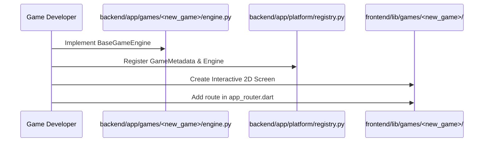

# PlayNed System Architecture & Specification

## 1. Architectural Philosophy

PlayNed enforces strict separation between:
1. **Platform Logic**: Auth, matchmaking, 6-character room codes, shareable invite links, player presence, WebSocket event broadcasting, reconnection handling, profile statistics, and navigation shell.
2. **Game Logic**: Pure deterministic state machines implementing legal move validation, board transitions, turn progression, and win/loss resolution.

```
GameState + PlayerMove + GameRules = NewGameState
```

---

## 2. Platform Core Components

### 2.1 Game Registry (`backend/app/platform/registry.py`)
Central catalog holding game definitions and matching rule engines:
- `hangman` (`HangmanGameEngine`)
- `dots_and_boxes` (`DotsAndBoxesEngine`)
- `quoridor` (`QuoridorEngine`)
- `pentago` (`PentagoEngine`)

### 2.2 Generic Room Manager (`backend/app/platform/room_manager.py`)
Manages room lifecycles across all game types:
- `WAITING`: Players joining, selecting teams, and toggling readiness.
- `IN_PROGRESS`: Authoritative match running with server-authoritative move validation.
- `FINISHED`: Match concluded, winner resolved, results recorded.

### 2.3 Real-Time WebSocket Gateway (`backend/app/routers/platform_ws.py`)
WebSocket endpoint: `/api/v1/ws/{room_code}/{player_id}`
Event Types:
- `PLAYER_CONNECTED` / `PLAYER_DISCONNECTED`
- `PLAYER_READY`
- `GAME_STARTED`
- `MOVE` -> validates and broadcasts `STATE_UPDATED`
- `PING` -> `PONG`

---

## 3. Game Engines Specification

### 3.1 Hangman Reimagined
- **Rules**: Deduce hidden English word before exhausting 5 hearts.
- **Scoring**: Base score per revealed occurrence + combo multiplier bonus.
- **Word DNA**: Vowel/consonant distribution, word length, repeated letter detection.

### 3.2 Dots & Boxes
- **Rules**: Alternating turn line-drawing on $R \times C$ dot grid.
- **Box Capture**: Completing the 4th line of a 1x1 cell awards 1 point and an immediate bonus turn.
- **Win Condition**: Full board completion -> highest score wins.

### 3.3 Quoridor
- **Rules**: Race 9x9 board from baseline to opposite goal line.
- **Actions**: Advance pawn 1 square orthogonally (with jump rules over opponents) OR place a 2-unit blocking wall.
- **Path Preservation**: Breadth-First Search (BFS) runs on every wall placement candidate to guarantee at least one valid path remains open for all players.

### 3.4 Pentago
- **Rules**: 6x6 board with four 3x3 rotatable quadrants.
- **Dual Turn Cycle**:
  1. Place marble in any empty cell.
  2. Rotate any quadrant 90° clockwise or counter-clockwise.
- **Win Condition**: 5 consecutive marbles in a row. Simultaneous 5-in-a-row results in a Draw.

---

## 4. How to Add a New Game to PlayNed



1. Create directory `backend/app/games/<game_id>/engine.py` inheriting from `BaseGameEngine`.
2. Register the game metadata and engine instance in `backend/app/platform/registry.py`.
3. Add the matching `GameMetadata` in `frontend/lib/platform/registry/game_registry.dart`.
4. Implement the 2D UI screen in `frontend/lib/games/<game_id>/presentation/pages/` and register the route in `frontend/lib/core/router/app_router.dart`.
