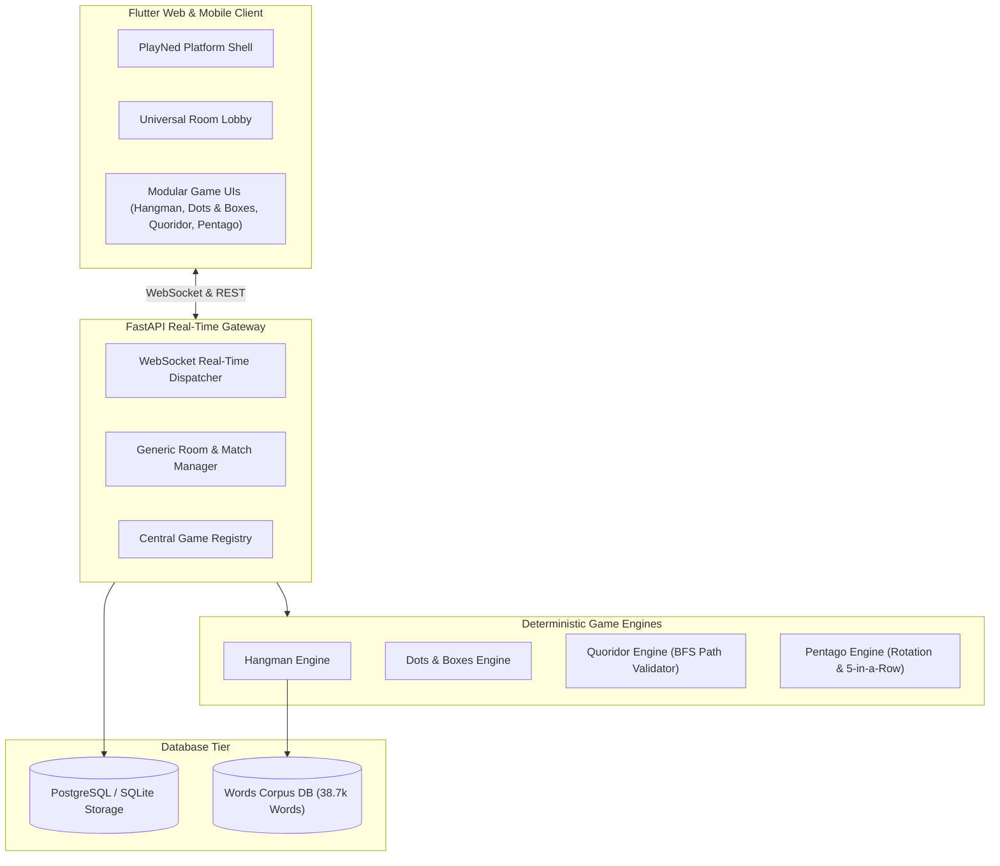

<div align="center">

# 🎮 PlayNed

### *Modern, Scalable 2D Multiplayer Game Platform*

[](https://flutter.dev)
[](https://fastapi.tiangolo.com)
[](https://python.org)
[](https://neon.tech)
[](LICENSE)

---

</div>

## 📖 Overview

**PlayNed** is a modern, modular 2D multiplayer gaming platform hosting a diverse collection of casual, strategy, deduction, and board games under a unified real-time architecture.

PlayNed separates **Platform Infrastructure** (rooms, matchmaking, presence, auth, profiles, routing, real-time WebSocket state synchronization) from **Deterministic Game Engines** (rules, legal moves, win conditions, board rendering).

---

## 🎲 Available Games

| Game | Category | Players | Description |
| :--- | :--- | :--- | :--- |
| **🔤 Hangman Reimagined** | Word / Puzzle | 1–4 | Vocabulary deduction with 38,000+ words, 100 level tiers, progressive clues, Word DNA metrics, lifelines, and turn-based duels. |
| **🟦 Dots & Boxes** | Strategy | 2–4 | Grid line capture classic. Complete the 4th wall of any 1x1 box to claim territory and score bonus turns. |
| **🧱 Quoridor** | Strategy | 2–4 | Mensa-awarded pawn race and dynamic wall blocking. Advance across a 9x9 board without completely sealing opponents' escape paths. |
| **🔄 Pentago** | Board | 2 | Swedish strategy classic. Place marbles on a 6x6 board, twist 3x3 quadrants 90°, and connect 5-in-a-row to win. |

---

## 🏗️ Architecture



---

## 🚀 Quick Start

### 1. Backend Setup

```bash
# Navigate to backend directory
cd backend

# Install dependencies
pip install -r requirements.txt

# Run FastAPI backend with Uvicorn
uvicorn backend.app.main:app --host 0.0.0.0 --port 8000 --reload
```

Backend API Documentation: `http://localhost:8000/docs`

### 2. Frontend Setup

```bash
# Navigate to frontend directory
cd frontend

# Install Flutter packages
flutter pub get

# Run Flutter Web / Desktop / Mobile
flutter run -d chrome
```

---

## 🧪 Running Tests

### Backend Tests (Pytest)
```bash
python -m pytest backend/tests
```

### Frontend Tests (Flutter)
```bash
flutter test
```

---

## ➕ How to Add a New Game to PlayNed

Adding a new game (e.g. Chess, Connect Four, Checkers, Battleship, Tic-Tac-Toe) takes 3 simple steps:

1. **Implement `BaseGameEngine` in `backend/app/games/<game_id>/engine.py`**:
   - `create_initial_state(player_ids, player_names, options)`
   - `validate_move(state, player_id, move)`
   - `apply_move(state, player_id, move)`
   - `get_available_moves(state, player_id)`

2. **Register in `backend/app/platform/registry.py` & Flutter `PlayNedGameRegistry`**:
   - Define `GameMetadata(id, name, category, min_players, max_players, ...)`

3. **Create Game Screen in `frontend/lib/games/<game_id>/presentation/pages/`**:
   - Register route in `app_router.dart`.
   - The platform handles rooms, codes, matchmaking, and WebSocket state sync automatically!

See [ARCHITECTURE.md](file:///c:/Users/patha/OneDrive/Desktop/HangMan_Game/ARCHITECTURE.md) and [CONTRIBUTING.md](file:///c:/Users/patha/OneDrive/Desktop/HangMan_Game/CONTRIBUTING.md) for full developer specifications.
